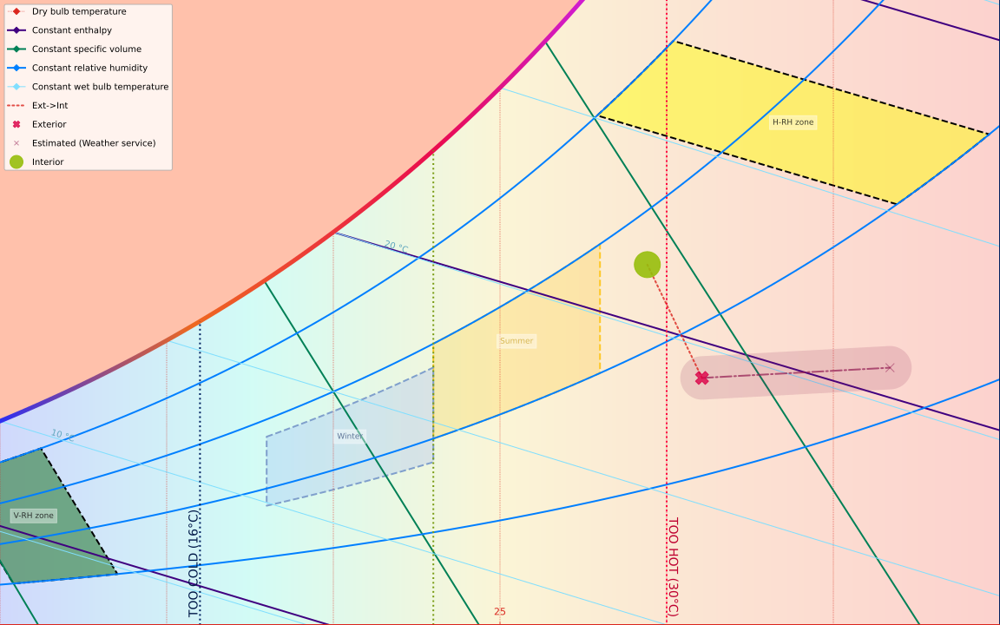
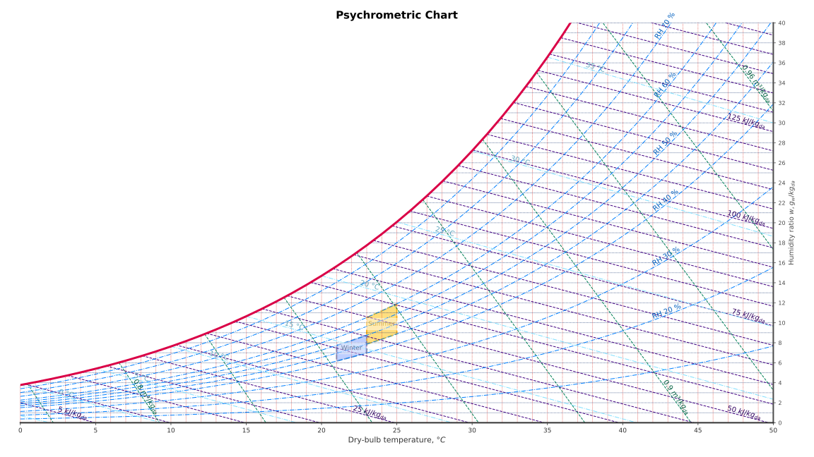
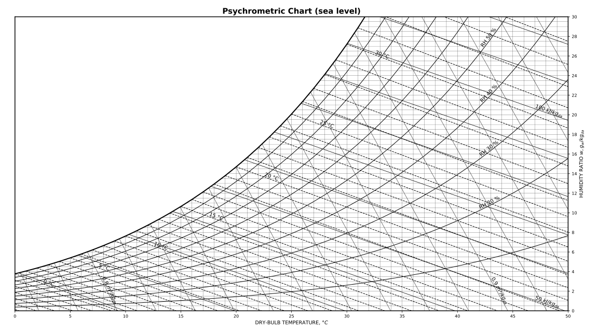
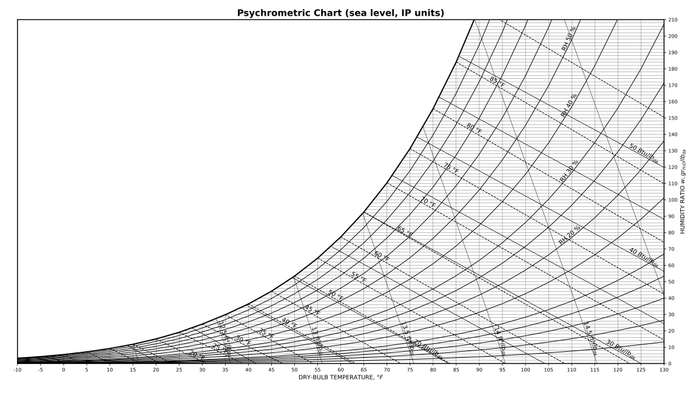
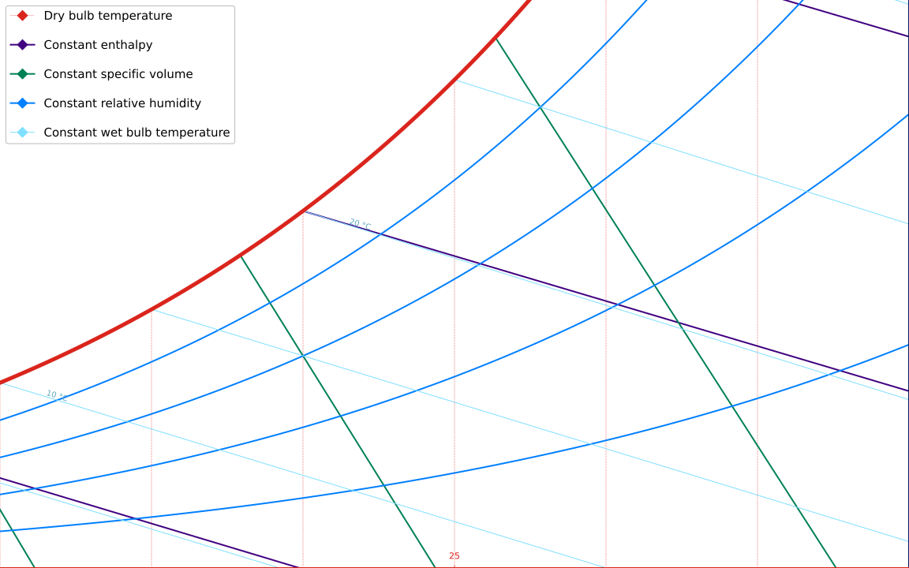

[![pre-commit.ci Status][pre-commit-ci-image]][pre-commit-ci-url]
[![Build Status][build-image]][build-url]
[![PyPI Version][pypi-image]][pypi-url]

<!-- Badges -->

[pre-commit-ci-image]: https://results.pre-commit.ci/badge/github/azogue/psychrochart/master.svg
[pre-commit-ci-url]: https://results.pre-commit.ci/latest/github/azogue/psychrochart/master
[build-image]: https://github.com/azogue/psychrochart/actions/workflows/main.yml/badge.svg
[build-url]: https://github.com/azogue/psychrochart/actions/workflows/main.yml
[pypi-image]: https://img.shields.io/pypi/v/psychrochart
[pypi-url]: https://pypi.org/project/psychrochart/

# Psychrochart

A python 3 library to make **[psychrometric charts](https://en.wikipedia.org/wiki/Psychrometrics)** and overlay information on them.

It implements a useful collection of psychrometric equations for moisture and humid air calculations, and the generation of beautiful and high customizable **psychrometric charts in SVG** with [`matplotlib`](https://matplotlib.org).

**Psychrometric calculations to make the chart data are done with [`PsychroLib`](https://github.com/psychrometrics/psychrolib)** (summary paper in https://doi.org/10.21105/joss.01137).



## Install

Get it **[from pypi](https://pypi.python.org/pypi?:action=display&name=psychrochart)** or **[clone it](https://github.com/azogue/psychrochart.git)** if you want to run the tests.

```shell
pip install psychrochart
```

## Features

- **SI** units (with temperatures in celsius for better readability), with _partial_ compatibility with IP system (imperial units)
- Easy style customization based on [**pydantic**](https://docs.pydantic.dev/latest/) models and config presets for full customization of **chart limits**, included lines and labels, colors, line styles, line widths, etc..
- Psychrometric charts within temperature and humidity ratio ranges, for any pressure\*, with:
  - **Saturation line**
  - **Constant RH lines**
  - **Constant enthalpy lines**
  - **Constant wet-bulb temperature lines**
  - **Constant specific volume lines**
  - **Constant dry-bulb temperature lines** (internal orthogonal grid, vertical)
  - **Constant humidity ratio lines** (internal orthogonal grid, horizontal)
- Plot legend for each family of lines, labeled zones and annotations
- Specify labels for each family of lines
- Overlay points, arrows, **data-series** (numpy arrays or pandas series), and convex hulls around points
- Define multiple kinds of **zones limited by psychrometric values**:
  - 'dbt-rh' for areas between dry-bulb temperature and relative humidity values,
  - 'enthalpy-rh' for areas between constant enthalpy and relative humidity values
  - 'volume-rh' for areas between constant volume and relative humidity values
  - 'dbt-wmax' for an area between dry-bulb temperature and water vapor content values (:= a rectangle cut by the saturation line),
  - 'xy-points' to define arbitrary closed paths in plot coordinates (dbt, abs humidity)
- **Export as SVG, PNG files**, or generate dynamic SVGs with extra CSS and <defs> with `chart.make_svg(...)`

> NOTE: The ranges of temperature, humidity and pressure where this library should provide good results are within the normal environments for people to live in.
>
> Don't expect right results if doing other type of thermodynamic calculations.
>
> ⚠️ **Over saturated water vapor states are not implemented**. This library is intended for HVAC applications only ⚠️

## Usage

```python
from psychrochart import PsychroChart

# Load default style:
chart_default = PsychroChart.create()
# customize anything
chart_default.limits.range_temp_c = (15.0, 35.0)
chart_default.limits.range_humidity_g_kg = (5, 25)
chart_default.config.saturation.linewidth = 1
chart_default.config.constant_wet_temp.color = "darkblue"
# plot
axes = chart_default.plot()
axes.get_figure()
# or store on disk
chart_default.save("my-custom-chart.svg")
```

Called from the terminal (`python psychrochart`), it plots and shows the default chart using the default matplotlib backend, equivalent to this python script:

```python
from psychrochart import PsychroChart
import matplotlib.pyplot as plt

PsychroChart.create().plot(ax=plt.gca())
plt.show()
```

### Chart customization

The default styling for charts is defined in JSON files that you can change, or you can pass a path of a file in JSON, or a dict, when you create the psychrometric chart object.
Included styles are: `default`, `ashrae`, `ashrae_ip` (adjusted for IP units), `interior`, and `minimal`.

```python
from pathlib import Path
from psychrochart import load_config, PsychroChart

# Load preconfigured styles:
chart_ashrae_style = PsychroChart.create('ashrae')
chart_ashrae_style.plot()

chart_minimal = PsychroChart.create('minimal')
chart_minimal.plot()

# Get a preconfigured style model and customize it
chart_config = load_config('interior')
chart_config.limits.range_temp_c = (18.0, 32.0)
chart_config.limits.range_humidity_g_kg = (1.0, 40.0)
chart_config.limits.altitude_m = 3000

custom_chart = PsychroChart.create(chart_config)
custom_chart.save("custom-chart.svg")

# serialize the config for future uses
assert chart_config.json() == custom_chart.config.json()
Path('path/to/chart_config_file.json').write_text(chart_config.json())
custom_chart_bis = PsychroChart.create('path/to/chart_config_file.json')
# or even the full psychrochart
Path('path/to/chart_file.json').write_text(custom_chart.json())
custom_chart_bis_2 = PsychroChart.parse_file('path/to/chart_file.json')

# Specify the styles JSON file:
chart_custom = PsychroChart.create('/path/to/json_file.json')
chart_custom.plot()

# Pass a dict with the changes wanted:
custom_style = {
    "figure": {
        "figsize": [12, 8],
        "base_fontsize": 12,
        "title": "My chart",
        "x_label": None,
        "y_label": None,
        "partial_axis": False
    },
    "limits": {
        "range_temp_c": [15, 30],
        "range_humidity_g_kg": [0, 25],
        "altitude_m": 900,
        "step_temp": .5
    },
    "saturation": {"color": [0, .3, 1.], "linewidth": 2},
    "constant_rh": {"color": [0.0, 0.498, 1.0, .7], "linewidth": 2.5,
                    "linestyle": ":"},
    "chart_params": {
        "with_constant_rh": True,
        "constant_rh_curves": [25, 50, 75],
        "constant_rh_labels": [25, 50, 75],
        "with_constant_v": False,
        "with_constant_h": False,
        "with_constant_wet_temp": False,
        "with_zones": False
    },
    "constant_v_annotation": {
        "color":[0.2, 0.2, 0.2],
        "fontsize":7,
        "bbox": dict(boxstyle="square,pad=-0.2", color=[1, 1, 1, 0.9], lw=0.5)
    },
    "constant_h_annotation": {
        "color":[0.2, 0.2, 0.2],
        "fontsize":6,
        "bbox": dict(boxstyle="square,pad=-0.1", color=[1, 1, 1, 0.9], lw=0.5)
    },
    "constant_wet_temp_annotation": {
        "color":[0.2, 0.2, 0.2],
        "fontsize":7,
        "bbox": dict(boxstyle="square,pad=0", color=[1, 1, 1, 0.9], lw=0.5)
    },
    "constant_rh_annotation": {
        "color":[0.2, 0.2, 0.2],
        "fontsize":7,
        "bbox": dict(boxstyle="square,pad=0", color=[1, 1, 1, 0.9], lw=0.5)
    }
}

chart_custom_2 = PsychroChart.create(custom_style)
chart_custom_2.plot()
```

The custom configuration does not need to include all fields, but only the fields you want to change.

To play with it and see the results, look at this **[notebook with usage examples](https://github.com/azogue/psychrochart/blob/master/notebooks/Usage%20example%20of%20psychrochart.ipynb)**.

## Development and testing

To run the tests, clone the repository, `poetry install` it, and run `poetry run pytest`.

Run `poetry run pre-commit run --all-files` to apply linters for changes in the code 😜.

## License

[MIT license](https://github.com/azogue/psychrochart/blob/master/LICENSE), so do with it as you like ;-)

## Included styling examples

**Default style**:



**ASHRAE Handbook black and white style**: (preset: `ashrae`)



**ASHRAE Handbook black and white style (IP units)**: (preset: `ashrae_ip`)



**Minimal style**: (preset: `minimal`)


